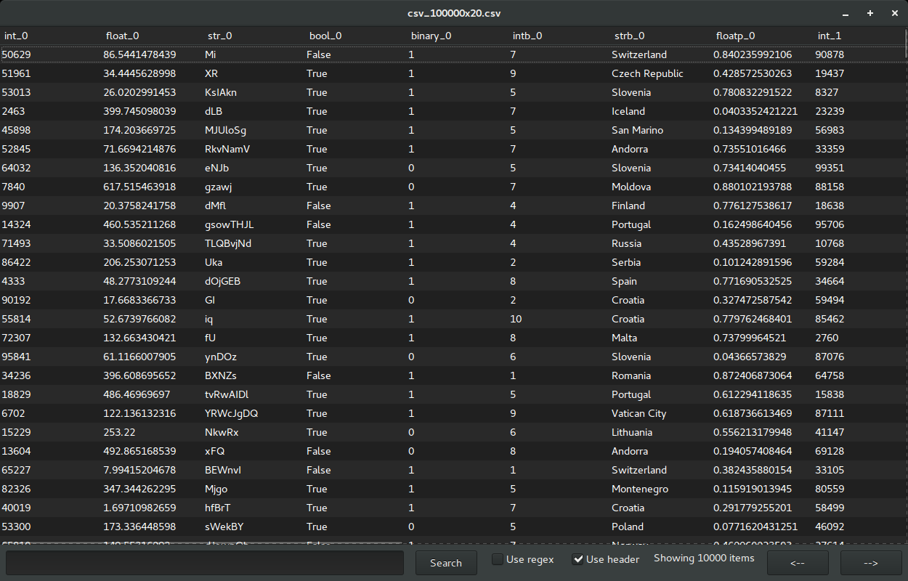
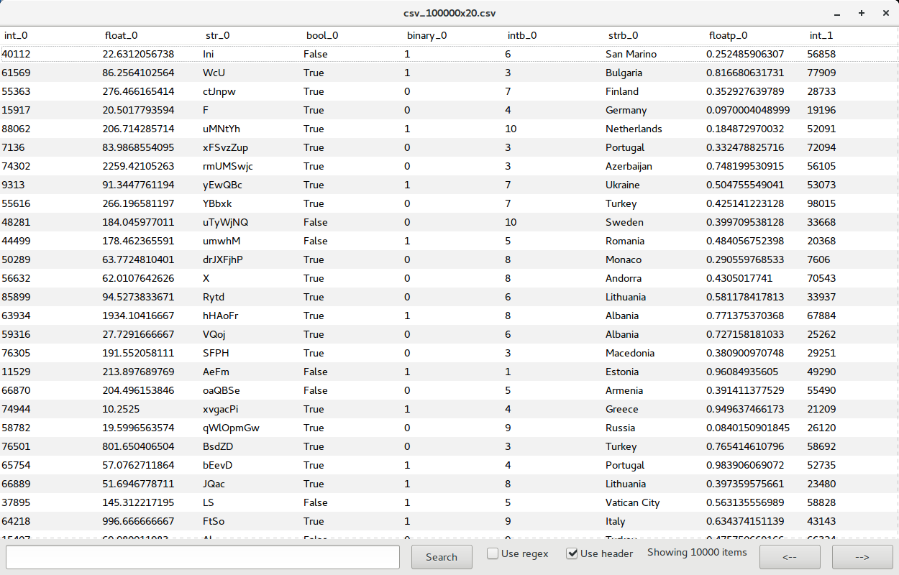
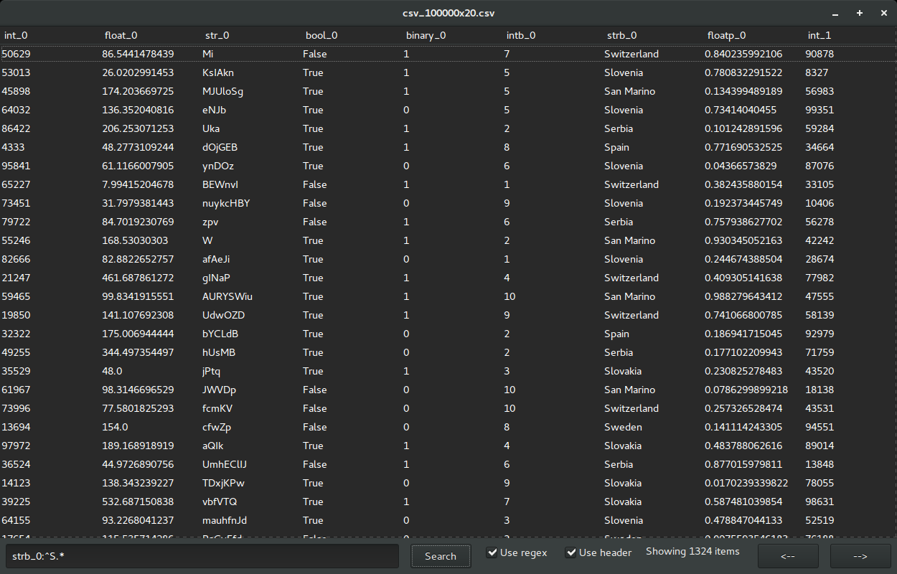
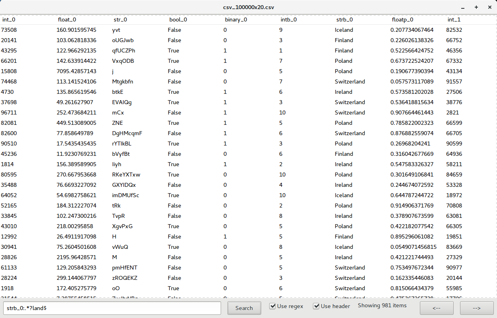
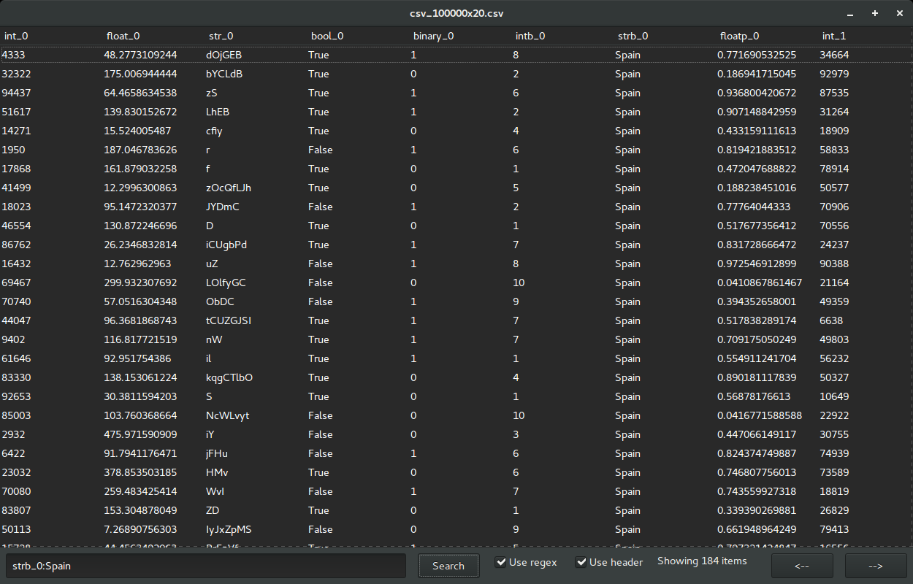
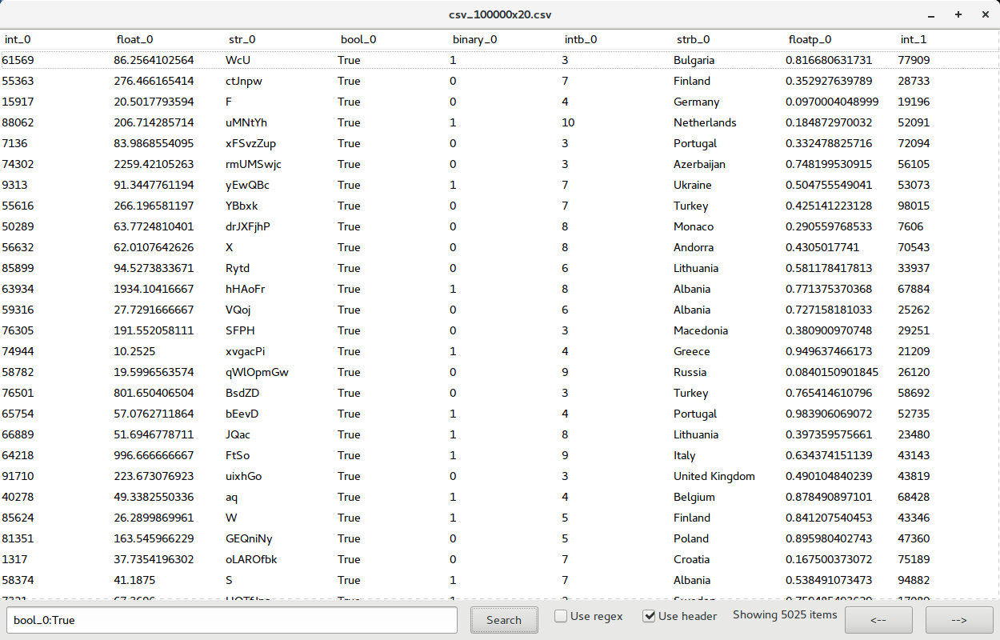

# PyViewer
A basic viewer for large files.

PyViewer loads the top N MB from a CSV-like file and displays it as a table for the user. It allows quick searching over the columns with regular expressions. 

## Usage

```sh
viewer.py [-hd|--header] [-re|--regex] [-s|--search column:row] filename
```

 * **header** treats first line of file as a header
 * **regex** treats the row argument of *search* as a regular expression
 * **search** displays only items matching the string/regex 'row' from column 'column'

* sample usages

```sh
$ cd src
$ python viewer.py ../sample-data/csv_100x10.csv
$ python viewer.py --header ../sample-data/csv_100x10.csv
$ python viewer.py --header -re -s strb_0:.*?land$ ../sample-data/csv_100x10.csv
```


## Additional configuration

Default parameters are read from the configuration file `config.json`. These are the following:

- **Buffer Size** - `buffer_size` -  Size of file in MB that is read into memory. If this is greater than the input file size, the entire file is read into memory.

- **Chunk Size** - `chunk_size`- Number of lines that are displayed in the viewer. Search and sorting operations are always performed on the visible chunk.

- **Header** - `header` - If True, the first line of the input file is treated as a header.

- **Separator** - `separator`- Delimiter for columns in the input file. Can be spaces, commas, tab, etc.

- **Highlight Lines** - `highlightLines` - If True, alternating lines are displayed with a different color. See Screenshots for examples.


## Wish List

- Show line counts for visible lines

- When searching from terminal, show top n based on search

- Search with numerical operators (e.g. greater than, less than).

- Search multiple columns or with multiple conditions.

- Better sorting. Currently, everything is treated as a string, which leads to unexpected sorting.

- Copy data to clipboard from viewer

- Editable cells and save to file


## Disclaimer

PyViewer was developed mostly as an exercise for me to get familiar with wxpython. It is a very simple tool and may not behave as expected at times. If you find issues, do let me know or submit pull requests with your fixes.

This tool was not tested on Windows or macOS environments. However, if you do use it in macOS, don't forget to install`python.app`in your environment and call the viewer with `pythonw`.


## Screenshots

These screenshots illustrate the viewer with a dark and a light theme, which is set by your Desktop Manager. These screenshots were taken on Ubuntu 16.04 with Gnome.















